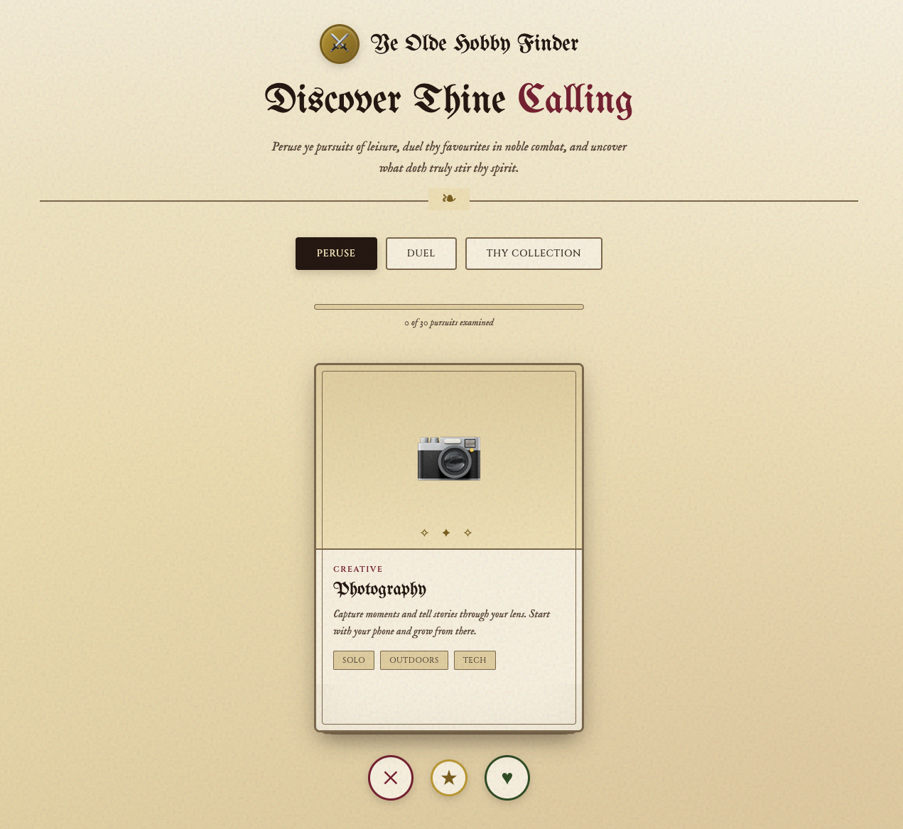
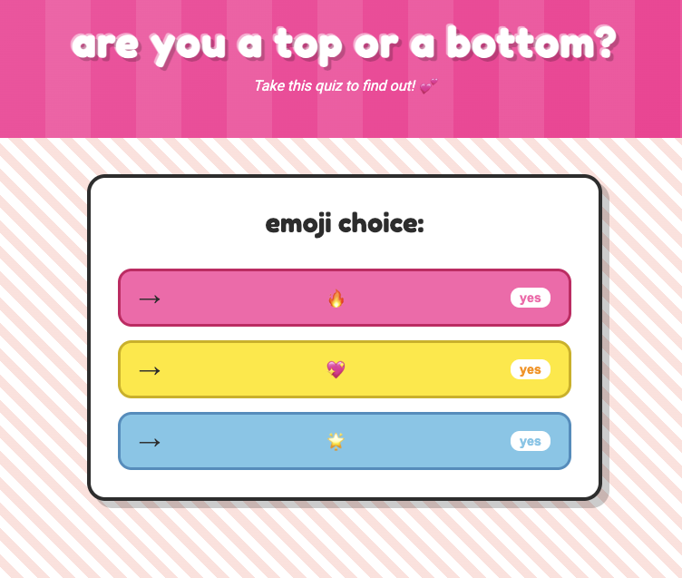
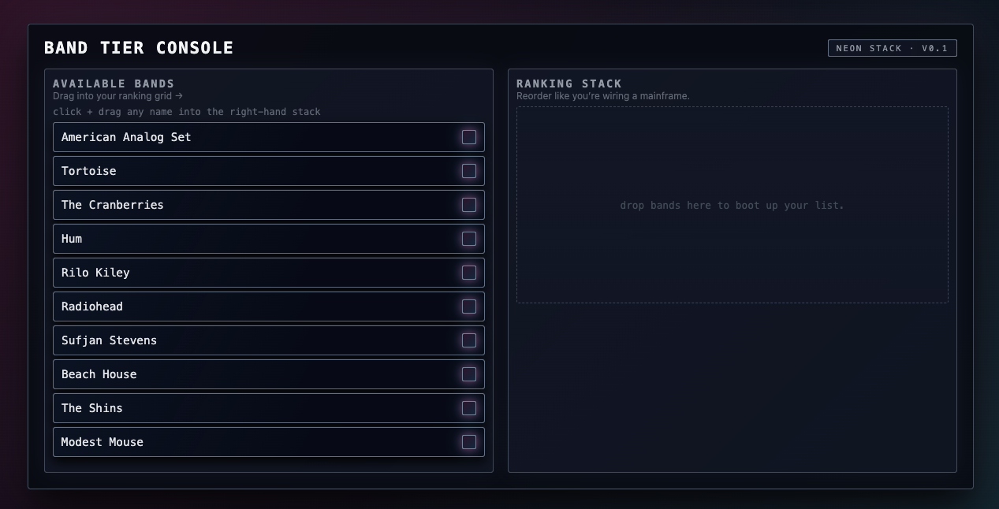

# Vibe Coding Workshops

Welcome to the Vibe Coding workshop repository! This is your central hub for learning AI-assisted coding techniques and building projects during our workshops.

## Contents

### Workshop Resources, Guides & Documentation

Reference guides and resources for vibe coding, project setup, and related tools.

**[Resource Viewer](https://workshop.nerktek.com/):**

**Start Here:**
- **[Welcome](https://workshop.nerktek.com/#welcome)** — Workshop overview and navigation
- **[Your Instructor](https://workshop.nerktek.com/#who-am-i)** — About Noah Eisenbruch
- **[What is Vibe Coding?](https://workshop.nerktek.com/#what-is-vibe-coding)** — How AI-assisted coding works
- **[Why Vibe Coding?](https://workshop.nerktek.com/#why-vibe-coding)** — An essential skill for the AI era
- **[Who Is It For?](https://workshop.nerktek.com/#who-is-vibe-coding-for)** — Bring your skills, technical or not
- **[What You'll Learn](https://workshop.nerktek.com/#what-youll-learn)** — From idea to deployed project
- **[Example Projects](https://workshop.nerktek.com/#example-projects)** — Real projects built with vibe coding
- **[Beyond Vibe Coding](https://workshop.nerktek.com/#beyond-coding)** — AI agents for way more than just building apps

**Tool Setup (Pick Your Level):**
- **[Pick Your Path](https://workshop.nerktek.com/#pick-your-path)** — Choose your setup based on comfort level
- **[Beginner: Quick Start](https://workshop.nerktek.com/#setup-beginner)** — Try vibe coding in your browser, no setup
- **[Beginner: Google AI Studio](https://workshop.nerktek.com/#setup-google-ai-studio)** — Free browser-based AI workspace
- **[Intermediate: Claude Desktop](https://workshop.nerktek.com/#setup-claude-desktop)** — Desktop AI assistant setup
- **[Intermediate: Antigravity + Gemini](https://workshop.nerktek.com/#setup-antigravity)** — Free AI-powered IDE
- **[Advanced: Antigravity + Claude](https://workshop.nerktek.com/#setup-antigravity-claude)** — Claude agent in Antigravity
- **[Advanced: Antigravity + Gemini](https://workshop.nerktek.com/#setup-antigravity-gemini)** — Gemini agent in Antigravity
- **[Advanced: VS Code + Claude](https://workshop.nerktek.com/#setup-claude-code)** — VS Code + AI agent setup
- **[Advanced: VS Code + Gemini](https://workshop.nerktek.com/#setup-gemini-cli)** — Free VS Code + AI agent setup

**Build Together:**
- **[Group Project](https://workshop.nerktek.com/#group-project)** — Guided group project everyone builds together

**Level Up:**
- **[Prompting & AI Mastery](https://workshop.nerktek.com/#prompting-guide)** — Core prompting techniques and strategies
- **[Product Guidance](https://workshop.nerktek.com/#product-guidance)** — Planning and managing your project
- **[Vibe Coding Techniques](https://workshop.nerktek.com/#Vibe%20Coding%20Techniques.md)** — Approaches and essential techniques
- **[Solo Project Guide](https://workshop.nerktek.com/#solo-project)** — Project ideas, setup, build cycle, deployment

**Deployment & Beyond:**
- **[Firebase & Deployment](https://workshop.nerktek.com/#Firebase%20%26%20Deployment.md)** — Backend, database, hosting
- **[Vercel & Supabase](https://workshop.nerktek.com/#Vercel%20%26%20Supabase.md)** — SQL database, auth, deployment
- **[Custom Domains](https://workshop.nerktek.com/#Custom%20Domains.md)** — Buying domains, Cloudflare, DNS setup

**Reference:**
- **[Git for Beginners](https://workshop.nerktek.com/#Git%20for%20Beginners.md)** — Simplified Git guide
- **[Claude Code Quick Reference](https://workshop.nerktek.com/#Claude%20Code%20Quick%20Reference.md)** — CLI commands and tips
- **[Advanced Techniques](https://workshop.nerktek.com/#Advanced%20Techniques.md)** — Agents, skills, MCP servers, git worktrees
- **[Project Idea Prompts](https://workshop.nerktek.com/#Project%20Idea%20Prompts%20-%20Extended.md)** — Starter prompts for simple, medium, and complex projects
- **[AI Tools Directory](https://workshop.nerktek.com/#AI%20Tools%20Directory.md)** — Comprehensive list of AI tools
- **[Backend & Hosting Platforms](https://workshop.nerktek.com/#Backend%20%26%20Hosting%20Platforms.md)** — Firebase vs Supabase vs Vercel vs Netlify vs Cloudflare
- **[Workshop Projects](https://workshop.nerktek.com/#Workshop%20Projects.md)** — Showcase of completed projects

### Workshop Projects

Browse completed workshop projects in the <a href="https://github.com/eisenbruch/vibe-coding-workshops/tree/master/workshop-projects" target="_blank">`workshop-projects/`</a> directory. Projects are organized by workshop date:

**<a href="https://github.com/eisenbruch/vibe-coding-workshops/tree/master/workshop-projects/2025-12-12-resistor" target="_blank">Workshop 2 - December 12, 2025 @ NYCResistor</a>**:
1. <a href="https://workshop.nerktek.com/workshop-projects/2025-12-12-resistor/group-project-hobby-finder/hobby-finder.html" target="_blank">Ye Olde Hobby Finder</a> - Group Project - Medieval-themed hobby discovery tool with Tinder-style swiping and head-to-head duels
 

**<a href="https://github.com/eisenbruch/vibe-coding-workshops/tree/master/workshop-projects/2025-11-15-resistor" target="_blank">Workshop 1 - November 15, 2025 @ NYCResistor</a>**:
1. <a href="https://workshop.nerktek.com/workshop-projects/2025-11-15-resistor/noah-eisenbruch-live-mjpeg-compression/index.html" target="_blank">Compressed MJPEG Stream with Glitch Effects</a> - Noah - Live webcam MJPEG feed with live compression control and glitch effects like pixel sorting (<a href="https://github.com/eisenbruch/live-mjpeg-compression" target="_blank">View Code</a>)
 
2. <a href="https://workshop.nerktek.com/workshop-projects/2025-11-15-resistor/hank-top-or-bottom/index.html" target="_blank">Are You a Top or a Bottom?</a> - Hank - Parody quiz styled after early 2000s magazine flowcharts
 
3. <a href="https://workshop.nerktek.com/workshop-projects/2025-11-15-resistor/andy-listing-thing/index.html" target="_blank">Band Tier Console</a> - Andy - Drag-and-drop ranking interface with cyberpunk aesthetic
 

## Share Your Work!

This repo is a living archive of our projects—it's more fun and inspiring with your work on it!

Your AI assistant can walk you through any of these methods, so consider trying Intermediate or Advanced to learn a little Git and GitHub along the way.

### Beginner: Email Your Project

1. **Zip** your project folder (right-click → "Compress" on Mac, "Compress to ZIP file" on Windows)
2. **Email** to noaheisenbruch@gmail.com
3. **Include** a brief description of what you built

### Intermediate: Share Your GitHub Repo

1. **Create** a new repository in your GitHub account
2. **Upload** your project files to the repo
3. **Email** the repo link to noaheisenbruch@gmail.com

### Advanced: Submit a Pull Request

1. **Fork** this repo: <a href="https://github.com/eisenbruch/vibe-coding-workshops" target="_blank">github.com/eisenbruch/vibe-coding-workshops</a>
2. **Clone** your fork to your computer
3. **Add** your project to the workshop folder (e.g., `workshop-projects/2025-12-12-resistor/your-name-project-name/`)
4. **Commit and push** your changes
5. **Open a Pull Request** from your fork to the main repo

I'll review and add your project to the site!

### Project Guidelines

- **Name your folder:** `your-name-project-name` (e.g., `sarah-todo-app`)
- **Include a README.md** explaining what it is (your AI can write this!)
- **No API keys or secrets** - keep sensitive info out of your code
